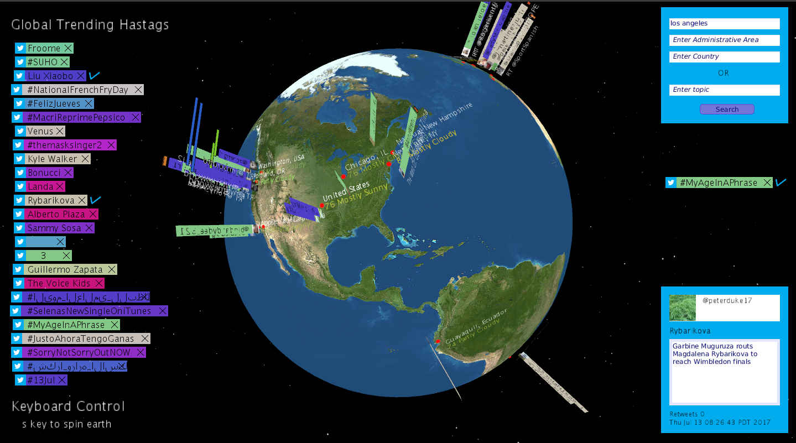

# EarthTwitterViewer

This is a Twitter feed viewer that uses Twitter API to graph global trends and allows hashtag, topic, and locality seaches for popular Tweets and plot the Longitude and Latitude postion with Google API.  It is design to show the trends in various regions of the Earth.

## Screenshot

